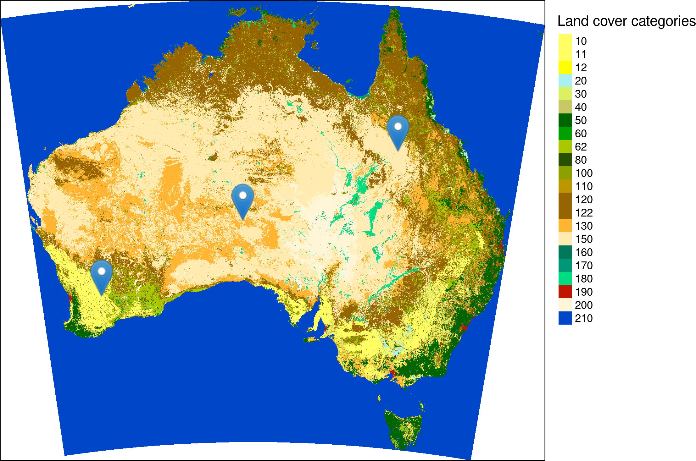

Landscape metrics are algorithms that quantify physical characteristics of landscape mosaics (aka categorical raster) in order to connect them to some ecological processes.
Many different landscape metrics exist and they can provide three main levels of information: (i) landscape level, (ii) class level, and (iii) patch level.
A landscape level metric gives just one value describing a certain property of a landscape mosaic, such as its diversity. 
A class level metric returns one value for each class (category) present in a landscape.
A patch level metric separates neighboring cells belonging to the same class, and calculates a value for each patch.^[For a more detailed explanation see https://r-spatialecology.github.io/landscapemetrics/articles/articles/general-background.html.]

Landscape metrics are often applied to better understand a landscape structure around some sampling points.
<!-- For example, ... .  -->
In this post, I show how to prepare input data and how to calculate selected landscape metrics based on different buffer sizes and shapes.
All calculations were performed in R, using [https://cran.r-project.org/web/packages/gdalUtils/index.html](**gdalUtils**), [https://github.com/r-spatial/sf](**sf**), and [https://github.com/rspatial/raster](**raster**) packages for spatial data handling, [https://github.com/tidyverse/purrr](**purrr**) to ease some calculations, and most importantly the [https://github.com/r-spatialecology/landscapemetrics](**landscapemetrics**) package was used to calculate landscape metrics.

# Data preparation

Every software for calculations of landscape metrics, such as FRAGSTATS or **landscapemetrics**, expects the input data in a projected coordinate reference system instead of a geographic coordinate reference system. 
This is due to a fact that geographic coordinate reference systems are expressed in degrees, and one degree on the equator has a different length in meters than one degree on a middle latitude.
Projected coordinate reference systems, on the other hand, have a linear unit of measurement such as meters.
This allows for proper calculations of distances or areas.^[More information about coordinate reference systems can be found at https://geocompr.robinlovelace.net/spatial-class.html#crs-intro.]

In this case, the input datasets (`cci_lc_australia.tif` and `sample_points.csv`) are in a geographic coordinate reference system called WGS84.
Therefore, it is important to reproject the data before calculating any landscape metrics.
Reprojection of raster objects is possible with an R package called **gdalUtils**:

```{r, eval=FALSE}
library(gdalUtils) 
dir.create("data")
# downloading the land cover data
download.file("https://github.com/Nowosad/lsm-bp1/raw/master/data/cci_lc_australia.zip",
              destfile = "data/cci_lc_australia.zip")
# unziping the file
unzip("data/cci_lc_australia.zip", "data/cci_lc_australia.tif")
# reprojecting the raster data to a local projected coordinate reference system
# read more at http://spatialreference.org/ref/epsg/gda94-australian-albers/
gdalwarp(srcfile = "data/cci_lc_australia.tif",
         dstfile = "data/cci_lc_australia_aea.vrt",
         of = "VRT",
         t_srs = "+proj=aea +lat_1=-18 +lat_2=-36 +lat_0=0 +lon_0=132 +x_0=0 +y_0=0 +ellps=GRS80 +towgs84=0,0,0,0,0,0,0 +units=m +no_defs")
# compressing the output file
gdal_translate(src_dataset = "data/cci_lc_australia_aea.vrt",
               dst_dataset = "data/cci_lc_australia_aea.tif",
               co = "COMPRESS=LZW")
```

Reading and reprojecting vector (points) objects can be done with the **sf** package:

```{r, eval=FALSE}
library(sf)
# downloading the points
download.file("https://raw.githubusercontent.com/Nowosad/lsm-bp1/master/data/sample_points.csv",
              destfile = "data/sample_points.csv")

# reading the point data and reprojecting it
points = read.csv("data/sample_points.csv") %>% 
  st_as_sf(coords = c("longitude", "latitude")) %>% 
  st_set_crs(4326) %>% 
  st_transform("+proj=aea +lat_1=-18 +lat_2=-36 +lat_0=0 +lon_0=132 +x_0=0 +y_0=0 +ellps=GRS80 +towgs84=0,0,0,0,0,0,0 +units=m +no_defs ")

# saving the new object to a spatial data format GPKG
st_write(points, "data/sample_points.gpkg")
```

```{r, echo=FALSE, fig.cap="Location of three sample points on a land cover map of Australia. Source of the input map: https://maps.elie.ucl.ac.be/CCI/viewer/"}

```

# Calculations of landscape metrics in a buffer

Now, we can read the new files - the new raster with the `raster()` function and the new points file with the `st_read()` function:

```{r, message=FALSE}
# attaching the packages used in the next examples
library(raster)
library(sf)
library(purrr)
library(landscapemetrics)

# reading the raster and vector datasets
lc = raster("data/cci_lc_australia_aea.tif")
sample_points = st_read("data/sample_points.gpkg", quiet = TRUE)
```

The **landscapemetrics** package has a function designed for calculations of landscape metrics for a given buffer.
It is called `sample_lsm()` and it expects, at least three input arguments - a raster, a vector (points), and a buffer size.
As a default, it calculates all of the available metrics in a square buffer, where buffer size is the side-length in map units (e.g. meters).

```{r, warning=FALSE}
square_all = sample_lsm(lc,
                        points = sample_points,
                        size = 3000)
square_all
```

The output, `square_all`, is a data frame containing values of all of the landscape metrics available in the **landscapemetrics** package.
The structure of the output is stable and contains the following columns:

1. `layer` - id of the input raster (landscape). It is possible to calculate landscape metrics on several rasters at the same time.
2. `level` - a landscape metrics level ("landscape", "class", or "patch").
3. `class` - a number of a class for class and patch level metrics.
4. `id` - a number of a patch for patch level metrics.
5. `metric` - a metric name.
6. `value` - an output value of the metric.
7. `plot_id` - id of the input vector (point).
8. `percentage_inside` - the size of the actual sampled landscape in %. It is not always 100% due to two reasons: (i) clipping raster cells using a buffer not directly intersecting a raster cell center lead to inaccuracies and (ii) sample plots can exceed the landscape boundary.

```{r, echo=FALSE, out.width='30%', fig.cap="Square buffers with the side-length of 3000 meters around the three sample points."}
knitr::include_graphics(c("figs/02-p1-map.png", "figs/03-p2-map.png", "figs/04-p3-map.png"))
```

The `sample_lsm()` function also allows for selecting metrics using a level name (`"landscape"`, `"class"`, or `"patch"`), a metric abbreviation, full name of a metric, or a metric type. 
For example, SHDI (Shannon's diversity index) on a landscape level (`"lsm_l_shdi"`) can be calculated using the code below.

```{r, warning=FALSE}
square_shdi = sample_lsm(lc,
                         points = sample_points,
                         size = 3000,
                         what = "lsm_l_shdi") 
square_shdi
```

The result shows that the area around the second sample point is the most diverse (SHDI value of 1.49), and the area around the third sample point is the least diverse (SHDI value of 0.665).

As the default, `sample_lsm()` uses a square buffer, but it could be changed to a circle one with the `shape` argument set to `"circle"`.
In this case, the size argument represents the radius in map units.

```{r, warning=FALSE}
circle_shdi = sample_lsm(lc,
                         points = sample_points,
                         size = 3000,
                         what = "lsm_l_shdi",
                         shape = "circle") 
circle_shdi
```

```{r, echo=FALSE, out.width='30%', fig.cap="Circle buffers with the radius of 3000 meters around the three sample points."}
knitr::include_graphics(c("figs/02-p1-map3.png", "figs/03-p2-map3.png", "figs/04-p3-map3.png"))
```

# Calculations of landscape metrics for many buffers

Finally, it is also possible to calculate landscape metrics on many different buffer sizes at the same time.
You just need to select what sizes you are interested in and use the `sample_lsm()` function inside a `map_dfr()` function.

```{r, warning=FALSE}
# creating buffers of 3000 and 6000 meters 
sizes = c(3000, 6000)

# calculating shdi (landscape metric) for each buffer
two_sizes_output = sizes %>% 
  set_names() %>% 
  map_dfr(~sample_lsm(lc, points = sample_points, what = "lsm_l_shdi", size = .), 
          .id = "buffer")
```

It calculates all of the selected metrics for all of the buffers.

```{r, echo=FALSE, out.width='30%', fig.cap="Square buffers with the side-length of 3000 and 6000 meters around the three sample points."}
knitr::include_graphics(c("figs/02-p1-map2.png", "figs/03-p2-map2.png", "figs/04-p3-map2.png"))
```

The result is a data frame, where the first column describes the buffer size, and the rest is a standard **landscapemetrics** output.

```{r}
two_sizes_output
```

# Summary

This post gave a few examples of how to calculate selected landscape metrics for buffers around sampling points using the **landscapemetrics** package and its function `sample_lsm()`.
In the same time, the **landscapemetrics** package has much more to offer, including [a lot of implemented landscape metrics](https://r-spatialecology.github.io/landscapemetrics/reference/index.html), a number of utility functions (e.g. `extract_lsm()` or `get_patches()`), and several C++ functions designed for the development of new metrics. 

The **landscapemetrics** is also an open-source collaborative project. 
It enables [community contributions](https://r-spatialecology.github.io/landscapemetrics/CONTRIBUTING.html), including documentation improvements, bug reports, and ideas to add new metrics and functions. 
To learn more you can visit the package website at https://r-spatialecology.github.io/landscapemetrics/.
